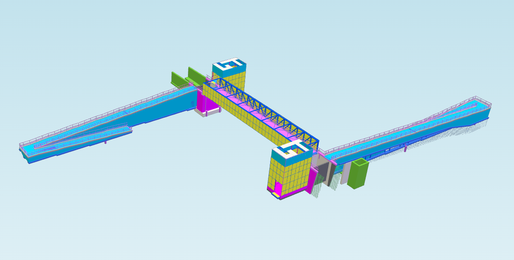

## Introduction 

---

In this tutorial, we'll load an IFC 4.3 model into a xeokit doc:Viewer. To optimize performance, we'll first 
convert the IFC model to XGF, xeokit's native compressed format. The import process consists of three steps:
1. Use `ifc2gltf` to convert the IFC into glTF and JSON metadata (*intermediate format*).
2. Use `ifc2gltf2xkt` to convert the glTF and JSON into XGF and a JSON data model (*final format*).
3. Use `doc:loadXGF` to load the XGF and JSON data model into a xeokit Viewer on a webpage.

This process splits the model into multiple files, improving memory stability in the converter tools and 
Viewer by allowing incremental loading and deallocation.

## Example IFC Model
---

In this tutorial, we'll import and view the Karhumaki Bridge model (source: [`http://drumbeat.cs.hut.fi/ifc/`](http://drumbeat.cs.hut.fi/ifc/)). Below is the final result— the model 
loaded in a Viewer from XGF and JSON data model files. In the following steps, we'll walk through the process 
of achieving this.

* *[Run this example](https://xeokit.github.io/sdk//models/index.html#viewModel.html?modelId=KarhumakiBridge&pipelineId=ifc2gltf2xgf)*

[](https://xeokit.github.io/sdk//models/index.html#viewModel.html?modelId=KarhumakiBridge&pipelineId=ifc2gltf2xgf)

<br>

## Step 1. Convert IFC into glTF and Metadata Files

---

The first step is to convert our IFC file into a set of intermediate glTF geometry and JSON metadata files. We'll use 
the [`ifc2gltf`]()
CLI tool to do this conversion step:

```bash
ifc2gltfcxconverter -i Karhumaki-Bridge.ifc -o model.glb -m model.json -s 100
```

The parameters we provided the tool are:

- `-i` specifies the IFC file to convert
- `-o` specifies the name to prefix on each output glTF file
- `-m` specifies the name to prefix on each JSON metamodel file
- `-s` specifies the maximum number of megabytes in each glTF file - smaller value means more output files, lower value
  means less files

The files output by `ifc2gltf` are listed below. Each of the JSON files follows the schema defined
by MetaModelParams, which is xeokit's legacy format for semantic model data.

```bash
.
├── model.glb.manifest.json
├── model_1.glb
├── model_1.json
├── model_2.glb
├── model_2.json
├── model_3.glb
├── model_3.json
├── model_4.glb
├── model_4.json
├── model_5.glb
├── model_5.json
├── model_6.glb
├── model_6.json
├── model_7.glb
├── model_7.json
├── model_8.glb
├── model_8.json
├── model_9.glb
├── model_9.json
├── model.glb
└── model.json
```

The `model.glb.manifest.json` manifest looks like below. This manifest follows the schema defined by Ifc2gltfManifestParams. 

```json
{
    "inputFile": "Karhumaki-Bridge.ifc",
    "converterApplication": "ifc2gltfcxconverter",
    "converterApplicationVersion": "2.8.6",
    "conversionDate": "2023-09-08 03:01:39",
    "gltfOutFiles": [
        "model.glb",
        "model_1.glb",
        "model_2.glb",
        "model_3.glb",
        "model_4.glb",
        "model_5.glb",
        "model_6.glb",
        "model_7.glb",
        "model_8.glb",
        "model_9.glb"
    ],
    "metadataOutFiles": [
        "model.json",
        "model_1.json",
        "model_2.json",
        "model_3.json",
        "model_4.json",
        "model_5.json",
        "model_6.json",
        "model_7.json",
        "model_8.json",
        "model_9.json"
    ]
}
```

<br>

## Step 2. Convert glTF and Metadata to XGF and Datamodel Files

---

The next step is to convert our set of intermediate glTF geometry and JSON metamodel files into the final set of XGF and data model files. 

We'll use the [`ifc2gltf2xgf`]()
CLI tool to do this conversion step:

```bash
node ifc2gltf2xgf -i model.glb.manifest.json -o model.xgf.manifest.json
```

The parameters we provided the tool are:

- `-i` specifies the glTF+Metadata manifest file to convert
- `-o` specifies the XGF+DataModel manifest file to output

The files output by `ifc2gltf2xgf` are listed below. Each of the JSON files follows the schema defined
by doc:DataModelParams, which is xeokit's new and more expressive *entity-relationship graph* format for semantic model data.

```bash
.
├── model.xgf.manifest.json
├── model_1.xgf
├── model_1.datamodel.json
├── model_2.xgf
├── model_2.datamodel.json
├── model_3.xgf
├── model_3.datamodel.json
├── model_4.xgf
├── model_4.datamodel.json
├── model_5.xgf
├── model_5.datamodel.json
├── model_6.xgf
├── model_6.datamodel.json
├── model_7.xgf
├── model_7.datamodel.json
├── model_8.xgf
├── model_8.datamodel.json
├── model_9.xgf
├── model_9.datamodel.json
├── model.xgf
└── model.datamodel.json
```

The `model.xgf.manifest.json` manifest looks like below. This manifest follows the schema defined by doc:ModelChunksManifestParams.

```json

{
    "sceneModelMIMEType": "arraybuffer",
    "sceneModelFiles": [
        "model.xgf",
        "model_1.xgf",
        "model_2.xgf",
        "model_3.xgf",
        "model_4.xgf",
        "model_5.xgf",
        "model_6.xgf",
        "model_7.xgf",
        "model_8.xgf",
        "model_9.xgf"
    ],
    "dataModelFiles": [
        "model.datamodel.json",
        "model_1.datamodel.json",
        "model_2.datamodel.json",
        "model_3.datamodel.json",
        "model_4.datamodel.json",
        "model_5.datamodel.json",
        "model_6.datamodel.json",
        "model_7.datamodel.json",
        "model_8.datamodel.json",
        "model_9.datamodel.json"
    ]
}
```

<br>

## Step 3. View the XGF and Datamodel Files

---

Now we'll create a Web page containing a xeokit doc:Viewer that views our converted model.

First install the npm modules we need:

````bash
npm install @xeokit/scene
npm install @xeokit/data
npm install @xeokit/modelchunksloader
npm install @xeokit/xgf
npm install @xeokit/core
npm install @xeokit/webglrenderer
npm install @xeokit/viewer
npm install @xeokit/cameracontrol
````

Then create an HTML page in `index.html` that contains a canvas element:

````html
<!DOCTYPE html>
<html>
<head>
    <title>xeokit XGF model, imported from IFC</title>
</head>
<body>
<canvas id="myView1"></canvas>
</body>
<script type="module" src="./index.js"></script>
</html>
````

Then create JavaScript in `index.js` to create the Viewer and view our converted model.

The steps in the JavaScript are as follows:

1. Import the packages we need.
2. Create a doc:Data to hold the IFC semantic data.
3. Create a doc:Viewer with a doc:Scene, a doc:WebGLRenderer and one doc:View.
4. Attach a doc:CameraControl to the View so that we can interact with it using mouse and touch.
5. Create a doc:SceneModel in the Scene.
6. Create a doc:DataModel in the Data.
7. Create a doc:ModelChunksLoader, configured to use doc:loadXGF load each XGF chunk, and doc:loadDataModel to load each JSON data model file.
8. Load our `model.xgf.manifest.json` manifest.
9. Use doc:ModelChunksLoader to load the files listed in the manifest into our SceneModel and DataModel.
10. Build the SceneModel and DataModel. The IFC model then appears in the Viewer.

```javascript
 // 1.

import {Scene} from "@xeokit/scene}";
import {Data, loadDataModel} from "@xeokit/data}";
import {ModelChunksLoader} from "@xeokit/modelchunksloader}";
import {loadXGF} from "@xeokit/xgf}";
import {WebGLRenderer} from "@xeokit/webglrenderer";
import {Viewer} from "@xeokit/viewer";
import {CameraControl} from "@xeokit/cameracontrol";

// 2. 

const data = new Data();

// 3.

const scene = new Scene();

const renderer = new WebGLRenderer({});

const viewer = new Viewer({
    id: "myViewer",
    scene,
    renderer
});

const view = viewer.createView({
    id: "myView",
    elementId: "myCanvas"
});

view.camera.eye = [0, 0, -100];
view.camera.look = [0, 0, 0];
view.camera.up = [0.0, 1.0, 0.0];

// 4. 

new CameraControl(view, {});

// 5.

const sceneModel = scene.createModel({
    id: "myModel"
});

// 6. 

const dataModel = data.createModel({
    id: "myModel"
});

// 7.

const modelChunksLoader = new ModelChunksLoader({
    sceneModelLoader: loadXGF,
    dataModelLoader: loadMetaModel
});

//  8.

fetch(`model.xgf.manifest.json`)
    .then(response => {
        response
            .json()
            .then(modelChunksManifest => {

                // 9.
                
                modelChunksLoader.load({
                    modelChunksManifest,
                    baseDir: ".",
                    sceneModel,
                    dataModel

                }).then(() => { // XGF and DataModel JSON files loaded
                    
                    // 10.
                    
                    sceneModel.build();
                    dataModel.build(); 
                    
                    // The Karhumaki Bridge model now appears in our Viewer.
                });
            });
    });
```

