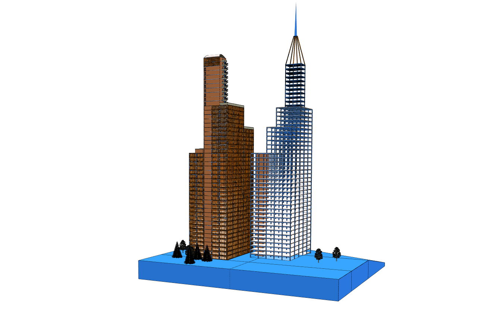

Let's use xeokit to show a spinning 3D box in a web page.

[](/packages/demos/examples/viewer/#SceneModel_build_table/index.html)

* *[Run this example](/packages/demos/examples/viewer/#SceneModel_build_table/index.html)*

First install the npm modules we need:

````bash
npm install @xeokit/scene
npm install @xeokit/viewer
npm install @xeokit/cameracontrol
npm install @xeokit/webglrenderer
npm install @xeokit/core/constants
````

Then create an HTML page in `index.html` that contains a canvas element:

````html
<!DOCTYPE html>
<html>
<head>
    <title>xeokit Spinning Box</title>
</head>
<body>
<canvas id="myView1"></canvas>
</body>
<script type="module" src="./index.js"></script>
</html>
````

Then create JavaScript in `index.js` to make a spinning box in the canvas. 

1. Import the modules we need.
2. Create a Viewer with a WebGLRenderer and a Scene.
3. In the Viewer, create a View that draws to the canvas.
4. Position the View's Camera to look at the center of the 3D coordinate system (default).
5. In the Scene, create a SceneModel that contains a SceneObject, a SceneMesh, and a SceneGeometry that defines the shape of the box.
6. Build the SceneModel. This causes the SceneMode's objects to appear in the View's canvas.
7. Get the Viewer's current configuration in a ViewerParams. Log the ViewerParams to the console.

````javascript
// 1.

import {Scene} from "@xeokit/scene";
import {TrianglesPrimitive} from "@xeokit/constants";
import {Viewer} from "@xeokit/viewer";
import {WebGLRenderer} from "@xeokit/webglrenderer";
import {CameraControl} from "@xeokit/cameracontrol";

// 2.

const renderer = new WebGLRenderer({});

const scene = new Scene();

const viewer = new Viewer({
    renderer,
    scene
});

// 3.

const view = viewer.createView({
    id: "myView",
    elementId: "myView1"
});

// 4.

view.camera.eye = [0, 0, 10]; // Looking down the -Z axis
view.camera.look = [0, 0, 0];
view.camera.up = [0, 1, 0];

// 5.

const sceneModel = scene.createModel(); // Start building the model

sceneModel.createGeometry({ // Define a box-shaped geometry
    id: "boxGeometry",
    primitive: TrianglesPrimitive,
    positions: [-1, -1, -1, 1, -1, -1, ...],
    indices: [0, 1, 2, 0, 2, 3, 4, 5, 6, 4, ...]
});

sceneModel.createMesh({
    id: "boxMesh",
    geometryId: "boxGeometry",
    color: [1, 1, 1]
});

sceneModel.createObject({
    id: "boxObject",
    meshIds: ["boxMesh"]
});

// 6.

sceneModel
    .build()
    .then(() => {

        // A box object now appears on our View's canvas.
        
        // 7.

        const viewerParams = viewer.getJSON();
        
        console.log(JSON.stringify(viewerParams, null, 2));
    });
````

